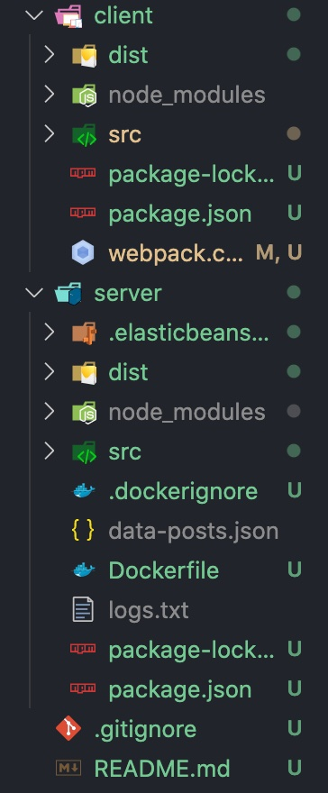

# Assignment - Weathermood Server File-TODO

## Description

Currently, the function of TODOs are written in client side. In this assignment, you need to implement these functions in server side like _posts_.

The client side code is in the `weathermood_no_redux` project, `server-file` branch  
The server side code is in the `weathermood-server_no_redux` project, `file` branch 

Hint:

1. You may want to trace the implementation of **posts** first. Below is an example of a GET request of posts

   1. `client/src/api/posts.js`: send API request to server
   2. `server/src/server.js`: `postRouter` is set to handle the request
   3. `server/src/routers/posts.js`: receive the GET request and ask postModel to handle the request
   4. `server/src/models/posts.js`: get all the posts from file and return a promise with data to router
   5. `server/src/routers/posts.js`: send response back to the clients
   6. `client/src/api/posts.js`: receive response and data.

2. It might be easier to start from _models_ to know what service your are providing, then _router_ to define the API. Once the API is clearly defined, all client do is just sending request and handling response.

## Granding

1. Deploy server and client to AWS.(must!!! or you will get 0)
2. (60%) Store and get TODOs item in server.
3. (20%) Unacomplished function: display TODOs item depends on checkbox.
4. (20%) accomplished function: click the TODOs item to strikethrough the item which means the TODOs is acomplished.  

## Submission

1. Upload your client code and server code to this project, server code under `server/` folder and client code under `client/` folder. The folder structure should look like below 

- Only one person needs to upload the project for each group, please select **the branch of your group** to send merge request

Your client url should be :  
`http://weathermood-2021-${group id}.${region}.elasticbeanstalk.com`  

## Deadline

Submit your work before 2021/05/13 (Thu.) 23:59:59
